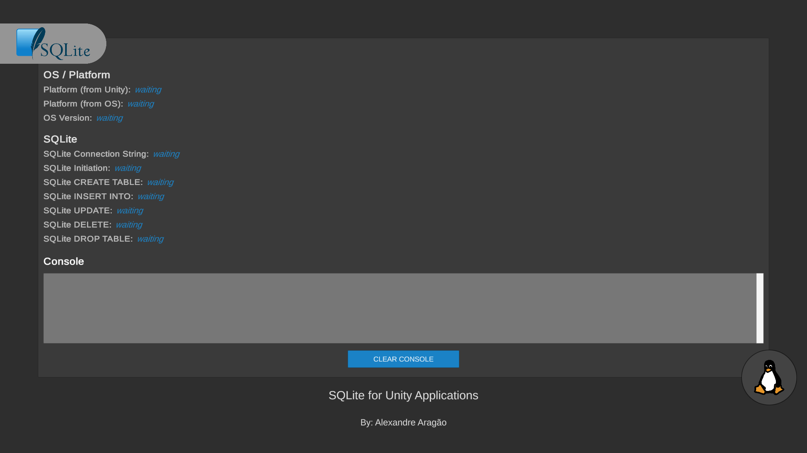
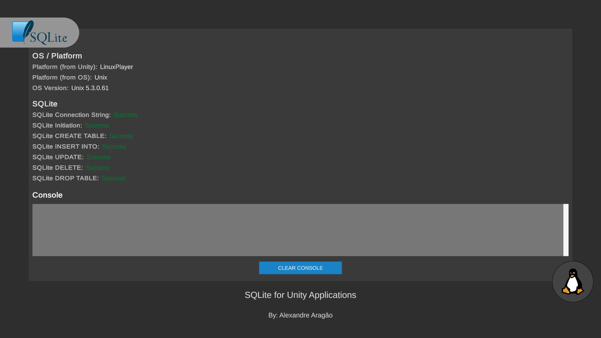
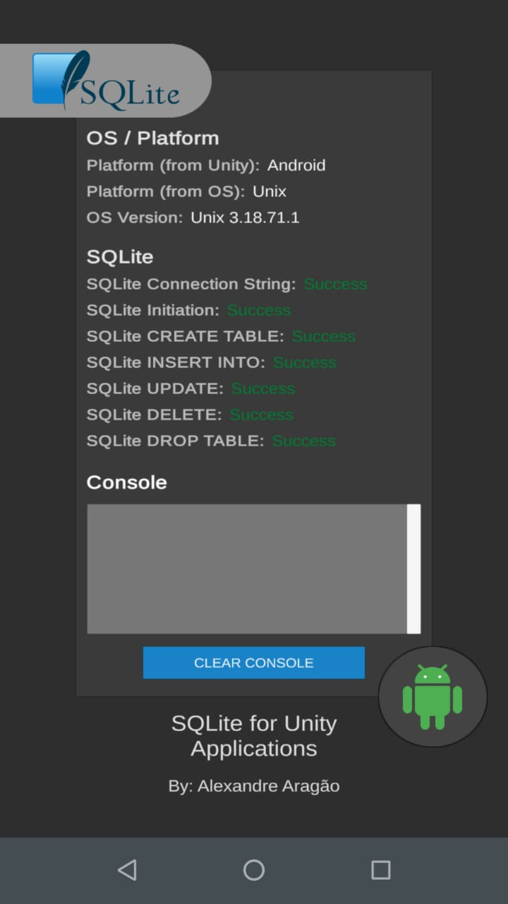
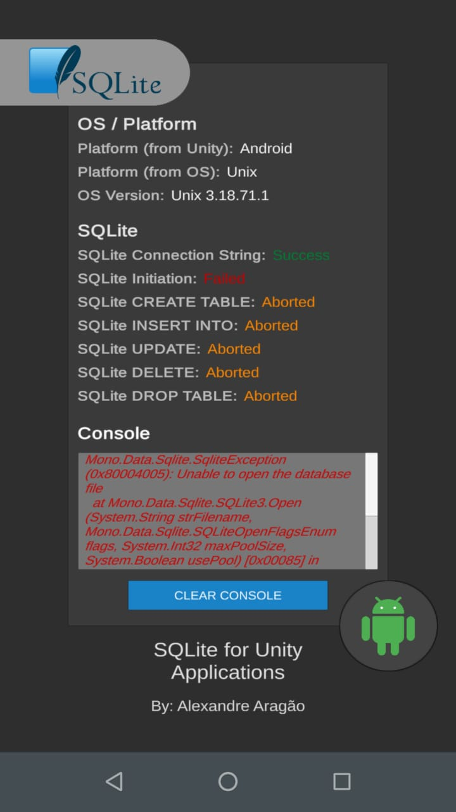

# SQLite for Unity Applications

### by: Alexandre Aragão

## Project Information
A simple unity project that intenst to test SQLite3 in unity-compatible platforms. This project was developed in Unity **2019.3.10f**.

### Usage
Well, there is no real usage of this project. But it is useful for check platforms support of SQLite3. For use, just clone the project and open it with unity.

The application tests:
- SQLite Connection String
- SQLite Connection (and database file check)
- SQLite CREATE TABLE command
- SQLite INSERT INTO command
- SQLite UPDATE command
- SQLite DELETE command
- SQLite DROP TABLE command

### Useful information
This project don't use any plugin but SQLite3. Which means that Plugins folder only contains plugins for SQLite3, so you can copy the folder and paste it in any other project. Easy SQLite3.

## Interface explanation
The application has one main screen, that shows some system information and some SQLite functions.

  
  
Figure 1. Application scene at first moment (Linux).

When runnig the application you probaly won't see the screen as show Figure 1. Once the application starts, it will shows all colected data and informations. Then you will probaly see the screen as show Figure 2.

  
  
Figure 2. Application scene after data loading (Linux).

Of course, you can get an error, as shows Figure 3b.

  

    

      

        
        
Figure 3a. SQLite success (Android).

      

    

    

      

        
        
Figure 3b. SQLite fail (Android).

      

    

  

### States explanation
- **waiting** - The application is waiting for data
- **success** - The command  was successfully executed
- **fail** - An error occurred while executing the command
- **aborted** - An error occurred before this command was executed

## Tests
### Target test platforms

- [x] Linux UnityEditor
- [x] Linux UnityPlayer
- [x] Android
- [ ] IPhone
- [ ] Windows UnityEditor
- [ ] Windows UnityPlayer
- [ ] MacOS UnityEditor
- [ ] MacOS UnityPlayer
- [ ] WebGL
- [ ] XBOX 360
- [ ] XBOX ONE
- [ ] PS3
- [ ] PS4

If you has tested some of the unchecked options, let me know :smiley:

### Tests results
Platform | Application works? | SQLite3 works? | Errors |
---------|--------------------|----------------|--------|
Linux UnityEditor | Yes |  Yes | None |
Linux UnityPlayer | Yes |  Yes | None |
Android | Yes | Yes  | None |
IPhone |  |   | None |
Windows UnityEditor | Yes | Yes | None |
Windows UnityPlayer | Yes | Yes  | None |
MacOS UnityEditor |  |  | None |
MacOS UnityPlayer |  |  | None |
WebGL |  |  | None |
XBOX 360 |  |  | None |
XBOX ONE |  |  | None |
PS3 |  |  | None |
PS4 |  |  | None |

## Icons licenses
- Android and Xbox One icons made by Pixel perfect from www.flaticon.com
- Web icon made by bqlqn from www.flaticon.com
- Linux, Windows, MacOS and PS4 icons made by Freepik from www.flaticon.com
- Default OS icon made by Eucalyp from www.flaticon.com